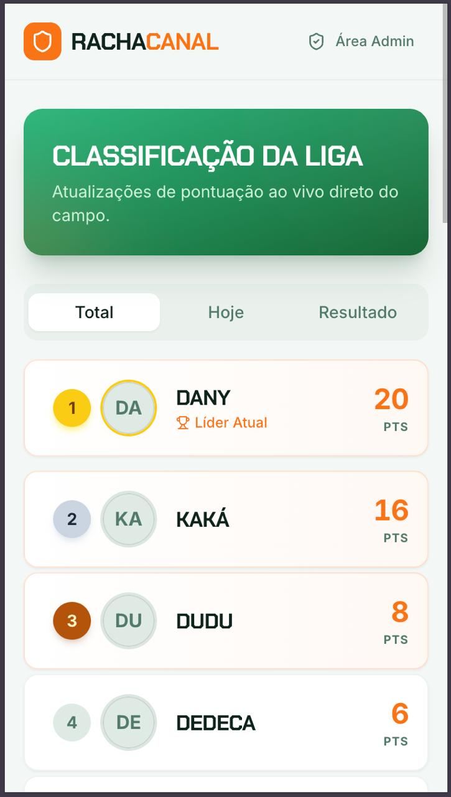
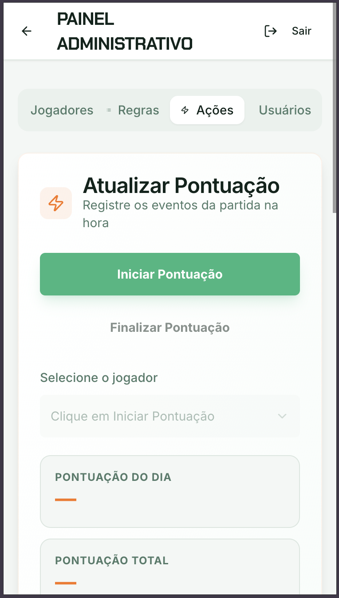
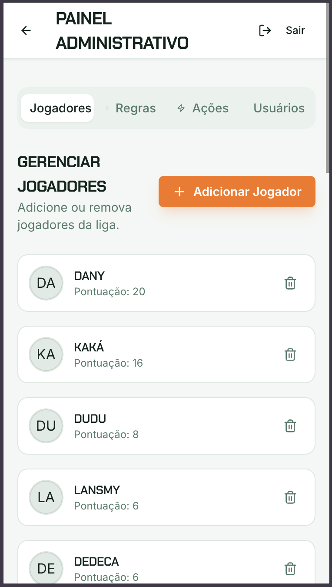
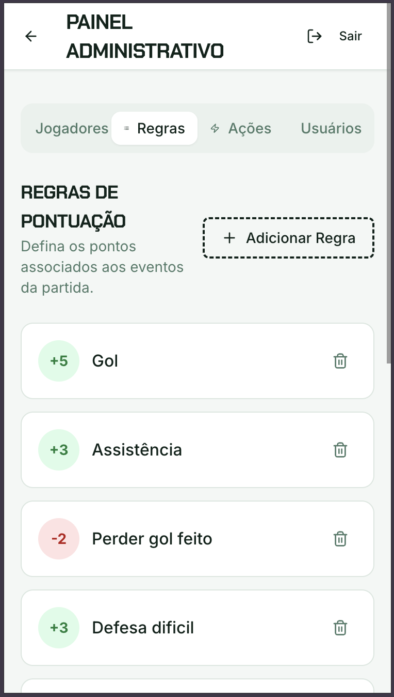
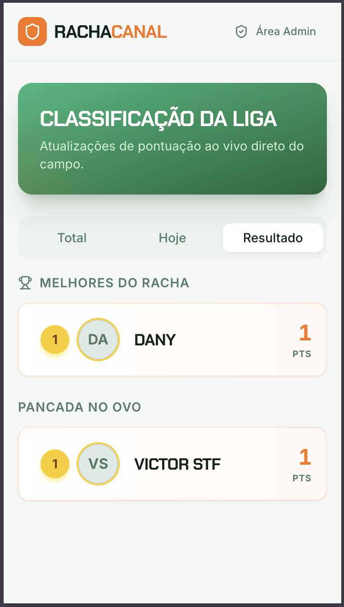

# Cartola Canal (RachaCanal)

App de ranking/pontuação para “racha” (liga), feito em **React + Ionic/Capacitor**, com **Firebase Auth** e **Firestore**.

## Principais features
- Ranking público (Home) com 3 abas:
  - **Pontuação Total** (ordenado por `score`)
  - **Pontuação do Dia** (ordenado por `scoreDay`)
  - **Pancada/Melhor** (listas por `bad` e `best`)
- Painel administrativo (Admin) com:
  - CRUD de jogadores e regras (categorias)
  - Fluxo de pontuação do dia: **Iniciar Pontuação → aplicar regras (+/-) → Aplicar Pontuação → Finalizar Pontuação**
- Mobile (iOS/Android) via Capacitor.

## Screenshots
Imagens do app na pasta `screenshot/`.

| Home | Iniciar Pontuação | Jogadores / Regras / Ações / Usuários |
| --- | --- | --- |
|  |  |  |

| Regras de Ponto | Pancada/Melhor |
| --- | --- |
|  |  |

## Stack
- React + Vite
- Ionic React (base CSS + `IonApp`)
- Firebase:
  - Authentication (email/senha)
  - Firestore (dados e permissões de admin via coleção `admins`)

## Requisitos
- Node.js **20.19+** (ou **22.12+**) e npm.

## Como rodar (Web)
1) Instalar dependências:
   - `npm install`
2) Criar o `.env` do client (ver “Variáveis de ambiente”):
   - `client/.env`
3) Rodar:
   - `npm run dev`

## GitHub Pages (web)
- URL: `https://macielcr7.github.io/cartola-racha/`
- Deploy:
  1) `npm run deploy`
  2) No GitHub: Settings → Pages → Source: `gh-pages` / `/ (root)`

## Variáveis de ambiente (Firebase)
No arquivo `client/.env`:
- `VITE_FIREBASE_API_KEY`
- `VITE_FIREBASE_AUTH_DOMAIN`
- `VITE_FIREBASE_PROJECT_ID`
- `VITE_FIREBASE_STORAGE_BUCKET`
- `VITE_FIREBASE_MESSAGING_SENDER_ID`
- `VITE_FIREBASE_APP_ID`
- `VITE_FIREBASE_MEASUREMENT_ID` (opcional)

Esses valores vêm do Firebase Console → Project settings → Your apps → Web app.

## Estrutura do Firestore
Coleções:
- `players/{id}`
  - `name: string`
  - `score: number`
  - `scoreDay: number`
  - `best: number`
  - `bad: number`
  - `createdAt?: timestamp`
- `categories/{id}`
  - `name: string`
  - `points: number`
  - `createdAt?: timestamp`
- `admins/{uid}`
  - `email?: string`
  - `createdAt?: timestamp`

## Admin (como dar permissão)
1) Crie o usuário no Firebase Console → Authentication → Users → Add user.
2) Copie o **UID**.
3) Firestore → coleção `admins` → crie um doc com **ID = UID**.

O app considera admin se existir `admins/{uid}`.

## Fluxo “Pontuação do Dia” (Admin → Ações)
- **Iniciar Pontuação**
  - zera `scoreDay` de todos os jogadores.
- Seleciona um jogador e ajusta as regras com `+`/`-` (isso só prepara o cálculo local).
- **Aplicar Pontuação**
  - salva a pontuação do dia no jogador: incrementa `scoreDay` e `score` pelo delta calculado.
- **Finalizar Pontuação**
  - incrementa `best` para todos com maior `scoreDay` (empates incluídos)
  - incrementa `bad` para todos com menor `scoreDay` (empates incluídos)

## Scripts úteis
- `npm run dev`: desenvolvimento (web)
- `npm run build`: build web (Vite)
- `npm run check`: TypeScript (tsc)
- `npm run cap:assets`: gera ícones/splash (usa `resources/icon.png`)
- `npm run build:app`: `cap:assets` + `build` + `cap sync`
- `npm run cap:add:android` / `npm run cap:add:ios`: adiciona plataformas (uma vez)
- `npm run cap:android` / `npm run cap:ios`: abre no Android Studio / Xcode
- `npm run deploy`: publica no GitHub Pages (branch `gh-pages`)

# Release Android/iOS (Ionic + Capacitor)

## Requisitos
- Node.js e npm instalados.
- Android Studio (Android SDK configurado).
- Xcode + CocoaPods (para iOS).

## Preparar assets
1) `npm run cap:assets`
2) O comando usa `resources/icon.png` como logo (1024x1024) e gera os ícones/splash automaticamente.
3) Confirme os arquivos gerados em `android/` e `ios/`.

## Build e sync
1) `npm install`
2) `npm run build:app`

## Android (debug)
1) `npm run cap:add:android` (apenas uma vez)
2) `npm run cap:android`

## Android (release)
1) Gere um keystore:
   - `keytool -genkeypair -v -keystore cartola-canal.keystore -alias cartola -keyalg RSA -keysize 2048 -validity 10000`
2) Configure assinatura em `android/app/build.gradle`.
3) Build:
   - Android Studio > Build > Generate Signed Bundle / APK.

## iOS (debug)
1) `npm run cap:add:ios` (apenas uma vez)
2) `npm run cap:ios`

## iOS (release)
1) Abra o projeto no Xcode.
2) Configure o bundle id para `com.cartola.canal`.
3) Ajuste o time de assinatura (Signing & Capabilities).
4) Product > Archive e siga o fluxo do App Store Connect.

## Atualizar versao
- `package.json` -> `version`.
- Android: `android/app/build.gradle` -> `versionCode` e `versionName`.
- iOS: `ios/App/App.xcodeproj` -> `Marketing Version` e `Build`.
